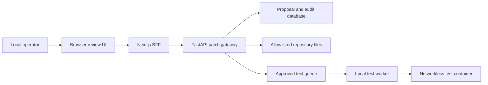

# Phase 9 local patch workflow threat model

## Executive summary

The Phase 9 boundary converts repository intelligence from read-only analysis into
local, separately approved mutation and test capabilities. The highest risks are
approval confusion, path escape, stale candidates, host command execution, test-code
egress, secret exposure, and container escape. Patch controls remain unchanged. Tests
now require a second digest-bound approval and a separate fail-closed Docker worker
with a staged read-only checkout, no network, non-root identity, dropped capabilities,
fixed argv/environment/cwd, resource limits, cancellation and durable evidence. Git,
deployment, dependency installation at run time, file creation in the live checkout,
host fallback, and remote multi-user execution remain out of scope.

## Scope and assumptions

- In scope: `agent_patches.py`, `agent_workflows.py`, `agent_tests.py`,
  `agent_test_worker.py`, their HTTP/persistence boundaries, the same-origin Next.js
  BFF, and the repository review UI.
- The user confirmed a trusted local developer/operator deployment. The service is not
  approved for public or remotely shared use.
- Existing owner authorization and tenant scoping remain mandatory
  (`apps/api-python/src/atlas_api/auth.py::require_principal`).
- Repository bytes remain untrusted model input; a provider never receives a direct
  filesystem, shell, network, Git, or patch-application tool
  (`apps/api-python/src/atlas_api/repository_ai.py::CodeIntelligenceProvider`).
- The worker image build is trusted operator/build activity; candidate test code is
  untrusted at runtime. Remote sandboxes and multi-user workspaces remain out of scope.

Open questions that would change risk ranking: public exposure, remote users, multiple
API worker processes sharing one checkout, or support for generated/new files would
require a new threat model and stronger identity/sandbox controls.

## System model

### Primary components

- Browser review UI: displays an exact server-generated diff and requires an explicit
  approval action.
- Next.js BFF: validates same-origin mutation requests and keeps the API bearer token
  server-side (`apps/web/src/lib/request-origin.ts`, `apps/web/src/app/api/ai/repository`).
- FastAPI patch gateway: re-authorizes the owner and enforces proposal state.
- Guarded filesystem adapter: resolves allowlisted paths beneath the configured root,
  checks hashes, and performs same-directory atomic replacement.
- Test approval policy: binds one pending proposal to a source-defined profile and
  immutable execution-policy digest (`agent_tests.py::test_run_digest`).
- Local worker: stages a bounded API subtree, overlays candidate bytes, and invokes a
  fixed Docker image without a shell (`agent_test_worker.py::DockerTestRunner`).
- Isolated test container: receives a read-only candidate mount and tmpfs only, with
  network disabled, capabilities dropped and CPU/memory/PID/time/output bounds.
- PostgreSQL/SQLite: stores tenant-scoped proposal, approval, application, rollback,
  and audit evidence (`apps/api-python/src/atlas_api/models.py::AuditEvent`).

### Data flows and trust boundaries

- Local operator → Browser: path, exact expected hash, bounded replacement, approval;
  browser input is untrusted and schema validated.
- Browser → Next.js BFF: JSON over same-origin HTTP; origin is checked and request size
  is bounded before forwarding.
- Next.js BFF → FastAPI: JSON over operator-configured HTTP with a server-only bearer;
  FastAPI repeats schema, role, tenant, digest, state, and hash validation.
- FastAPI → Repository: UTF-8 text through an allowlisted resolver; no caller absolute
  path, symlink escape, binary, secret file, shell, or network operation is accepted.
- FastAPI → Database: immutable proposal evidence and state transitions through the ORM;
  filesystem and database cannot share one transaction, so an `applying` journal state
  makes interrupted writes detectable.
- FastAPI → Worker database queue: exact test profile ID/digest and separate approval;
  the API does not execute the test and caller input cannot supply argv or environment.
- Worker → staged directory → Docker container: bounded regular files and reviewed
  candidate bytes cross a host filesystem/container boundary; the mount is read-only,
  network is `none`, and only fixed environment values are forwarded.

#### Diagram

## Assets and security objectives

| Asset | Why it matters | Security objective (C/I/A) |
|---|---|---|
| Repository source | A malicious or mistaken write can compromise the product | I/A |
| Secrets and operator files | Must never enter proposals or model context | C/I |
| Approval evidence | Proves which exact bytes the operator authorized | I |
| Tenant proposal records | Must not cross organization boundaries | C/I |
| Audit history | Required to investigate sensitive mutations | I/A |
| Local developer availability | Oversized or repeated writes must not exhaust the workstation | A |
| Worker host and Docker daemon | Container escape or daemon misuse can compromise the workstation | I/A |
| Test evidence | Must prove which candidate/profile ran without becoming mutation authority | I/A |

## Attacker model

### Capabilities

- Can control browser request bodies and attempt direct calls to BFF/API endpoints.
- Can place adversarial instructions in otherwise readable repository content.
- Can race a legitimate proposal by changing a source file before approval.
- Can attempt traversal, symlink, encoding, oversized-change, and stale-digest inputs.
- Can place malicious executable behavior in candidate Python imported by a fixed test.
- Can try to exhaust output, processes, CPU, memory, disk, or wall time in the container.

### Non-capabilities

- Cannot reach the local-only service from the public internet under the approved model.
- Does not already control the operator account, API process, OS, or repository root.
- Cannot select executable, arguments, image, cwd, environment, mount, or Docker flags.
- Cannot use container networking or mutate the live checkout under the intended
  Docker isolation; a Docker/OS compromise remains a residual local-host risk.

## Entry points and attack surfaces

| Surface | How reached | Trust boundary | Notes | Evidence |
|---|---|---|---|---|
| Proposal creation | Same-origin BFF POST | Browser → BFF → API | Untrusted structured replacement | `apps/web/src/lib/request-origin.ts` |
| Approval/application | Same-origin BFF POST | Operator → privileged mutation | Must bind exact digest and current hash | `apps/api-python/src/atlas_api/ai_routes.py` |
| Rollback | Same-origin BFF POST | Operator → privileged mutation | Only restores captured original when patched hash still matches | `apps/api-python/src/atlas_api/ai_routes.py` |
| Repository resolver | Internal API call | API → filesystem | Root, prefix, extension, size, UTF-8, symlink controls | `apps/api-python/src/atlas_api/repository_ai.py::RepositorySourceReader` |
| Proposal storage | ORM session | API → database | Tenant-scoped immutable bytes and state transitions | `apps/api-python/src/atlas_api/models.py` |
| Test request/approval | Same-origin BFF POST | Operator → API → queue | Separate digest and exact confirmation; pending proposal only | `apps/api-python/src/atlas_api/agent_tests.py` |
| Worker claim/cancel/recovery | Database polling | Queue → worker | Fixed profiles, heartbeat, terminal evidence | `apps/api-python/src/atlas_api/agent_test_worker.py` |
| Interrupted-run retry | Same-origin BFF POST | Operator → API → queue | New ID/digest/attempt; predecessor remains immutable; new approval required | `apps/api-python/src/atlas_api/agent_tests.py`, `ai_routes.py` |
| Candidate execution | Docker CLI | Worker → container | No shell, no network, read-only mount, non-root, limits | `apps/api-python/src/atlas_api/agent_test_worker.py::docker_command` |

## Top abuse paths

1. Attacker submits `../` or a symlink path → resolver escapes the checkout → secret or
   system file is overwritten. Mitigation: resolved-root containment and symlink denial.
2. Operator reviews proposal A → attacker substitutes proposal B → approval writes
   unreviewed bytes. Mitigation: approval includes the server-generated SHA-256 digest.
3. Source changes after review → stale patch overwrites newer work. Mitigation: current
   source hash must match the proposal's original hash immediately before replacement.
4. Retrieved prompt injection asks the model to edit sensitive files → model output is
   treated as authority. Mitigation: model has no write tool; server allowlists and human
   approval are authoritative.
5. Patch introduces executable behavior and is applied automatically. Mitigation: no
   auto-approval, bounded visible diff, syntax checks where deterministic, and no test or
   shell execution in this slice.
6. Process crashes between filesystem and database commits → state and bytes diverge.
   Mitigation: journaled transitional status, content hashes, structured failure audit,
   and hash-safe rollback/reconciliation.
7. Malicious candidate runs during tests → attempts host egress or secret theft → gains
   workstation access. Mitigation: no host fallback, networkless non-root container,
   read-only staged mount, no host secrets/environment, dropped privileges/capabilities.
8. Candidate forks or emits indefinitely → exhausts workstation. Mitigation: PID, CPU,
   memory/swap, wall-time and output bounds plus forced container cancellation.
9. Passing result is confused with patch approval → unreviewed code is applied.
   Mitigation: independent digests/actions/state; test completion never mutates proposal.
10. An interrupted approval is replayed → changed policy or stale evidence executes
    without review. Mitigation: retry creates a new ID, lineage-bound digest and pending
    record; the prior approval cannot queue the replacement.
11. A workflow history is changed or a future graph reinterprets an old edge → the
    operator trusts a false replay. Mitigation: graph version pinned per workflow,
    source-owned conditional edges, and read-only replay that validates each event.

## Threat model table

| Threat ID | Threat source | Prerequisites | Threat action | Impact | Impacted assets | Existing controls (evidence) | Gaps | Recommended mitigations | Detection ideas | Likelihood | Impact severity | Priority |
|---|---|---|---|---|---|---|---|---|---|---|---|---|
| TM-001 | Malicious request | Endpoint reachable | Escape root or target a sensitive file | Arbitrary overwrite or disclosure | Source, secrets | Read path containment (`repository_ai.py::RepositorySourceReader`) | Read policy is insufficient for writes | Separate write allowlist, resolved containment, reject symlinks/dotfiles/new files | Count rejected path reasons | medium | high | high |
| TM-002 | Request tampering | Valid pending proposal | Approve different bytes than reviewed | Unreviewed code mutation | Source, approval evidence | Owner role and audit (`ai_routes.py`) | Approval not yet bound to bytes | Canonical proposal digest, exact confirmation, immutable proposal | Alert digest/state mismatch | medium | high | high |
| TM-003 | Concurrent editor | File changes after proposal | Apply stale replacement | Lost work or corrupted source | Source availability/integrity | Source SHA already used for citations (`repository_ai.py`) | No write-time compare | Compare original SHA under process lock immediately before atomic replace | Stale-source metric and audit | high | medium | high |
| TM-004 | Prompt-injected content | Hostile text is retrieved | Coerce model into privileged mutation | Repository compromise | Source, secrets | Injection signals and no provider tools (`repository_retrieval.py`) | Future tool expansion could erode boundary | Keep provider tool-free; treat output only as proposal; server policy wins | Audit rejected targets and repeated attempts | medium | high | high |
| TM-005 | Local misuse or bug | Approved mutation | Apply malformed or oversized content | Broken build or workstation pressure | Source, availability | Request/body limits in existing BFF routes | Language validation incomplete | File/change quotas, UTF-8/NUL checks, Python/JSON parsing, no binary writes | Validation outcome metrics | medium | medium | medium |
| TM-006 | Process/IO failure | Crash during application | Persist misleading state | Rollback and audit ambiguity | Source, audit | Immutable audit events (`models.py::AuditEvent`) | DB/filesystem lack atomic transaction | Journal `applying`, store before/after hashes and original bytes, reconcile by hash | Alert lingering transitional states | low | high | medium |
| TM-007 | Remote caller | Local service accidentally exposed | Reuse development credential and mutate source | Repository compromise | All repository assets | Same-origin BFF and bearer (`request-origin.ts`, `auth.py`) | Development token is not remote-grade identity | Fail closed unless explicit local mode; document non-public binding; require OIDC/sandbox before remote use | Startup warning and mutation audit | low under assumption | high | medium |
| TM-008 | Malicious candidate | Separately approved fixed profile | Execute code that reads secrets, reaches network, or changes host files | Host/repository compromise or exfiltration | Host, secrets, source | Network none, read-only staging, scrubbed env, non-root and dropped caps (`agent_test_worker.py::docker_command`) | Docker/OS isolation is not a formal untrusted-code VM boundary | Keep local-only; use signed minimal image; add seccomp/AppArmor where supported; migrate remote use to ephemeral microVM | Alert worker/container failures and denied policy states | low under local assumption | high | high |
| TM-009 | Malicious candidate | Test container starts | Fork, allocate, loop, or flood output | Local denial of service | Host availability, evidence store | CPU/memory/swap/PID/time/output limits (`TestProfile`, `DockerTestRunner.run`) | Staging disk and Docker daemon remain shared local resources | Add worker concurrency=1, disk quota and daemon-level monitoring | Metrics for timeout/output limit/worker failure and duration | medium | medium | medium |
| TM-010 | Confused operator or API bug | Test completes | Treat passing evidence as permission to apply | Unreviewed mutation | Source, approval evidence | Separate test and patch digests/endpoints; worker writes only test record (`ai_routes.py`, `agent_test_worker.py`) | UI proximity can still cause human confusion | Preserve distinct labels; never add auto-apply transition; regression-test state independence | Audit sequence correlation by proposal ID | medium | high | high |
| TM-011 | Worker crash or replay attempt | Container is running or an interrupted run exists | Lose result state, leave orphan compute, or reuse old approval | Availability and ambiguous evidence | Host, audit | Heartbeat, deterministic container name, force removal, explicit retry with new ID/digest/attempt and approval (`agent_test_worker.py`, `agent_tests.py`) | Recovery begins only when worker restarts; orphan scan remains local | Add daemon-level orphan scan before remote use; retain immutable retry lineage | Alert stale heartbeat, interrupted status and repeated retries | low | medium | medium |
| TM-012 | History tampering or incompatible policy | Stored workflow events or policy revision changes | Present a misleading replay or suggest a privileged branch was valid | Operator decision integrity | Workflow evidence | Version-pinned source graph and edge-by-edge replay validation (`agent_workflows.py`) | A database administrator can still alter both row and JSON history; this is not a signed log | Preserve old graph definitions and add tamper-evident external audit before remote use | Count replay validation failures and compare audit sequence | low under local assumption | medium | medium |

## Criticality calibration

- Critical: public pre-auth arbitrary write, sandbox escape to OS files, or cross-tenant
  remote code execution. None is acceptable in the local slice.
- High: approved-diff substitution, repository-root escape, or stale overwrite of valuable
  source. These directly compromise integrity but still require reaching the local service.
- Medium: bounded denial of service, malformed source, or recoverable journal mismatch.
- Low: rejected probing, metadata-only errors, or failures with no file mutation.

## Focus paths for security review

| Path | Why it matters | Related Threat IDs |
|---|---|---|
| `apps/api-python/src/atlas_api/agent_patches.py` | Central path, digest, state, and atomic-write policy | TM-001–TM-006 |
| `apps/api-python/src/atlas_api/agent_workflows.py` | Transition graph must never bypass validation or approval | TM-002, TM-004, TM-006 |
| `apps/api-python/src/atlas_api/ai_routes.py` | Authentication, tenant authorization, and mutation entry points | TM-002, TM-007 |
| `apps/api-python/src/atlas_api/models.py` | Approval and recovery evidence integrity | TM-002, TM-006 |
| `apps/web/src/app/api/ai/repository/patches` | Same-origin and payload boundary | TM-002, TM-005, TM-007 |
| `apps/web/src/components/repository-ai-workspace.tsx` | Human review clarity and explicit approval UX | TM-002 |
| `apps/api-python/tests/test_agent_patches.py` | Regression coverage for the privileged boundary | TM-001–TM-007 |
| `apps/api-python/src/atlas_api/agent_tests.py` | Immutable profile and second-approval policy | TM-008–TM-010 |
| `apps/api-python/src/atlas_api/agent_test_worker.py` | Staging, Docker isolation, cancellation and recovery boundary | TM-008–TM-011 |
| `apps/api-python/Dockerfile.test-worker` | Minimal fixed execution image and non-root runtime | TM-008, TM-009 |
| `apps/api-python/tests/test_agent_tests.py` | Regression coverage for fixed policy and approval separation | TM-008–TM-011 |

## Quality check

Operator-memory extension (2026-10-01): untrusted operator notes are stored in a
separate tenant table and never loaded by inference, replay or MCP discovery. The
local-only owner boundary, bounded DTOs and database 50-slot invariant constrain access
and resource use. Recognizable secrets/approval material are rejected before persistence;
operator attestation and best-effort warnings cover the remaining DLP limitation.
Browser text is escaped, not interpreted as HTML/Markdown or instructions. Creation,
expiry cleanup and deliberate deletion commit content-free audit metadata with the
mutation. Expired text is hidden at read/open-page expiry; physical deletion is demand-
driven on save or explicit cleanup, not a background retention guarantee. Database
pages, WAL and backups are not securely erased. BFF origin/UUID/body validation,
server-only credentials, no-store and rejection-body redaction preserve the credential
boundary. API tests cover tenant denial, expiry equality, quota constraints and privacy;
UI/BFF tests cover deliberate actions, inert rendering and disabled automatic context.
Future model-context consumption requires a new poisoning/provenance review.
Source: `agent_memory.py`, `agent_memory_routes.py`, `agent-memory-workspace.tsx`.

MCP discovery extension (2026-10-01): the local owner-only catalog reveals source-owned
schemas and policy metadata, not instance evidence, host paths or secrets. It has no
dispatcher or mutation endpoint and renders schemas as inert escaped JSON. A confused
operator could mistake enabled flags or schema validity for approval: explicit disabled
invocation labels, separate flag/worker-health wording, strict literal-false contracts,
and no tool-action controls mitigate this risk. API auth/owner/organization/local checks
and no-side-effect tests cover disclosure and elevation; BFF no-store, fixed upstream,
timeout and redacted failures preserve the existing credential boundary. Future MCP
transport/invocation is outside this review and must revalidate all gateway controls.
Source: `agent_mcp.py`, `repository-mcp-explorer.tsx`, discovery API/BFF tests.

- Covered proposal, patch approval/application, test request/approval, worker claim,
  candidate staging/execution, cancellation/recovery, rollback and persistence.
- Covered browser/BFF/API/database/filesystem/worker/container trust boundaries.
- Separated runtime candidate execution from worker-image build/CI and provider inference.
- Reflected the user's confirmed local/operator-only deployment choice.
- Remote/multi-user use, new files, shell commands, and multiple writers remain explicitly
  out of scope and require a new review.
